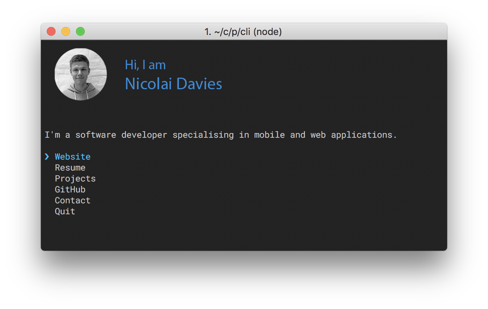

# sindresorhus [](https://travis-ci.org/sindresorhus/sindresorhus)

The [Nicolai Davies](https://sindresorhus.com) CLI

Idea stolen from [Sindre Sorhus](https://github.com/sindresorhus). Take a look at his [Original cli](https://github.com/sindresorhus/sindresorhus).



## Usage

Install Node.js, then:

```
$ npx nicolai
```